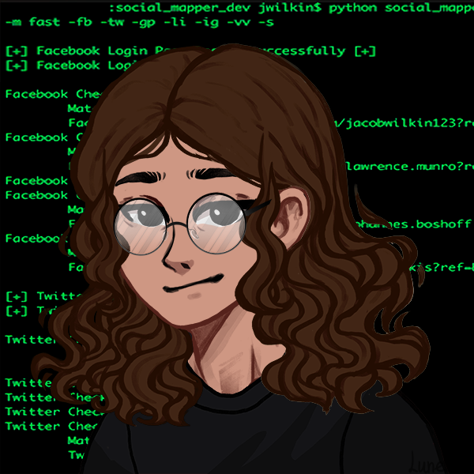

<h1 align="center">Hi, I'm Joy :)</h1>

## About Me 👩🏻‍💻
 <table border="0">
  <tr>
    <td>

 Hello everyone my name is Joice, better known as Joy, I'm 17 years✨

I've always been very curious and questioning about EVERYTHING, knowing how things work makes me very happy and fulfilled and the more complex it is the better.

I love challenges, they make me feel alive, in fact I think that without them life is a little boring. 

And in this profile you can find some of my projects😉

    </td>
    <td>
    
    </td>
  </tr>
</table>

 

## Languages and Tools 

  
 More 

  
## Analytics & Highlights

 <h1 align="center">&nbsp;
&nbsp;

&nbsp;

  
  
 
<a href="https://metrics.lecoq.io/insights/joymtdev" target="_blank" rel="noreferrer"></img></a>

 

